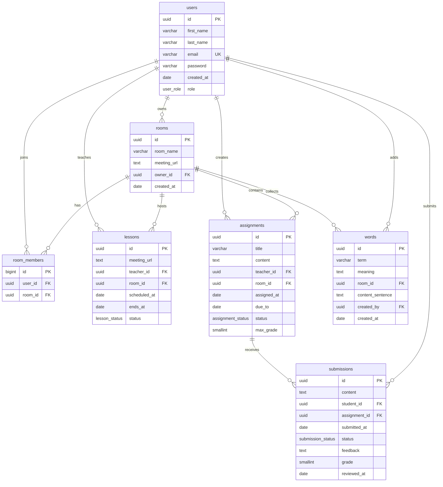

# Database Schema

Linguistix uses **PostgreSQL**, with migrations managed by [`node-pg-migrate`](https://github.com/salsita/node-pg-migrate).

- Migrations live in `migrations/`. Run them with `npm run migrate up`.
- The current schema is defined in a single migration: `migrations/1791052707599_init.ts`.
- Primary keys are UUID v7 (`DEFAULT uuidv7()`), so IDs sort by creation time. The built-in `uuidv7()` function needs **PostgreSQL 18+**.

## Overview

| Table          | Purpose                                                        |
| -------------- | -------------------------------------------------------------- |
| `users`        | Every account on the platform, either a student or a teacher.  |
| `rooms`        | Classrooms or study groups, each with one owner.               |
| `room_members` | Join table linking users to the rooms they belong to.          |
| `lessons`      | Scheduled live sessions in a room, run by a teacher.           |
| `assignments`  | Homework a teacher sets for a room.                            |
| `submissions`  | A student's answer to an assignment, with its grade and feedback. |
| `words`        | Vocabulary entries collected in a room.                        |

## ER Diagram

## Enum Types

| Type                | Values                                                  | Used by               |
| ------------------- | ------------------------------------------------------- | --------------------- |
| `user_role`         | `student`, `teacher`                                    | `users.role`          |
| `lesson_status`     | `scheduled`, `completed`, `canceled`, `in_progress`     | `lessons.status`      |
| `assignment_status` | `draft`, `published`, `closed`                          | `assignments.status`  |
| `submission_status` | `pending`, `submited`, `needs_revision`, `reviewed`     | `submissions.status`  |

> `submission_status` spells `submited` with one "t". Application code has to use that exact spelling.

## Tables

### `users`

Every account on the platform. The `role` column decides whether the user is a student or a teacher.

| Column       | Type           | Null | Default        | Notes                  |
| ------------ | -------------- | ---- | -------------- | ---------------------- |
| `id`         | `UUID`         | no   | `uuidv7()`     | Primary key            |
| `first_name` | `VARCHAR(100)` | no   |                |                        |
| `last_name`  | `VARCHAR(100)` | no   |                |                        |
| `email`      | `VARCHAR(255)` | no   |                | Unique                 |
| `password`   | `VARCHAR(255)` | no   |                | Stores the password hash |
| `created_at` | `DATE`         | no   | `CURRENT_DATE` |                        |
| `role`       | `user_role`    | no   |                |                        |

### `rooms`

A classroom or study group. Lessons, assignments and vocabulary all belong to a room.

| Column        | Type           | Null | Default        | Notes                                      |
| ------------- | -------------- | ---- | -------------- | ------------------------------------------ |
| `id`          | `UUID`         | no   | `uuidv7()`     | Primary key                                |
| `room_name`   | `VARCHAR(100)` | no   |                |                                            |
| `meeting_url` | `TEXT`         | yes  |                | Default video-call link for the room       |
| `owner_id`    | `UUID`         | yes  |                | FK → `users.id`, `ON DELETE RESTRICT`      |
| `created_at`  | `DATE`         | no   | `CURRENT_DATE` |                                            |

Because of `RESTRICT`, you cannot delete a user who still owns a room. Delete the room or transfer ownership first.

### `room_members`

Many-to-many join table between `users` and `rooms`.

| Column    | Type     | Null | Default                       | Notes                                |
| --------- | -------- | ---- | ----------------------------- | ------------------------------------ |
| `id`      | `BIGINT` | no   | `GENERATED ALWAYS AS IDENTITY` | Primary key                          |
| `user_id` | `UUID`   | yes  |                               | FK → `users.id`, `ON DELETE CASCADE` |
| `room_id` | `UUID`   | yes  |                               | FK → `rooms.id`, `ON DELETE CASCADE` |

### `lessons`

A live session in a room, run by a teacher.

| Column         | Type            | Null | Default        | Notes                                     |
| -------------- | --------------- | ---- | -------------- | ----------------------------------------- |
| `id`           | `UUID`          | no   | `uuidv7()`     | Primary key                               |
| `meeting_url`  | `TEXT`          | yes  |                | Overrides the room's link for this lesson |
| `teacher_id`   | `UUID`          | yes  |                | FK → `users.id`, `ON DELETE CASCADE`      |
| `room_id`      | `UUID`          | yes  |                | FK → `rooms.id`, `ON DELETE CASCADE`      |
| `scheduled_at` | `DATE`          | no   | `CURRENT_DATE` |                                           |
| `ends_at`      | `DATE`          | no   |                |                                           |
| `status`       | `lesson_status` | no   | `'scheduled'`  |                                           |

### `assignments`

Homework a teacher sets for a room. Draft assignments can be incomplete. Any other status requires all content fields to be filled.

| Column        | Type                | Null | Default   | Notes                                 |
| ------------- | ------------------- | ---- | --------- | ------------------------------------- |
| `id`          | `UUID`              | no   | `uuidv7()`| Primary key                           |
| `title`       | `VARCHAR(255)`      | yes* |           |                                       |
| `content`     | `TEXT`              | yes* |           |                                       |
| `teacher_id`  | `UUID`              | yes  |           | FK → `users.id`, `ON DELETE SET NULL` |
| `room_id`     | `UUID`              | yes  |           | FK → `rooms.id`, `ON DELETE CASCADE`  |
| `assigned_at` | `DATE`              | yes* |           |                                       |
| `due_to`      | `DATE`              | yes* |           | Due date                              |
| `status`      | `assignment_status` | no   | `'draft'` |                                       |
| `max_grade`   | `SMALLINT`          | yes* |           |                                       |

\* **`chk_published_field_not_null`**: when `status <> 'draft'`, the columns `title`, `content`, `assigned_at`, `due_to` and `max_grade` must all be non-null.

### `submissions`

A student's answer to an assignment, plus the teacher's review.

| Column          | Type                | Null | Default        | Notes                                      |
| --------------- | ------------------- | ---- | -------------- | ------------------------------------------ |
| `id`            | `UUID`              | no   | `uuidv7()`     | Primary key                                |
| `content`       | `TEXT`              | no   |                |                                            |
| `student_id`    | `UUID`              | yes  |                | FK → `users.id`, `ON DELETE CASCADE`       |
| `assignment_id` | `UUID`              | yes  |                | FK → `assignments.id`, `ON DELETE CASCADE` |
| `submitted_at`  | `DATE`              | no   | `CURRENT_DATE` |                                            |
| `status`        | `submission_status` | no   | `'pending'`    |                                            |
| `feedback`      | `TEXT`              | yes  |                | Teacher's comments                         |
| `grade`         | `SMALLINT`          | yes  |                |                                            |
| `reviewed_at`   | `DATE`              | no   |                |                                            |

### `words`

Vocabulary entries collected in a room, each with its meaning and an example sentence.

| Column             | Type           | Null | Default        | Notes                                 |
| ------------------ | -------------- | ---- | -------------- | ------------------------------------- |
| `id`               | `UUID`         | no   | `uuidv7()`     | Primary key                           |
| `term`             | `VARCHAR(255)` | no   |                |                                       |
| `meaning`          | `TEXT`         | no   |                |                                       |
| `room_id`          | `UUID`         | yes  |                | FK → `rooms.id`, `ON DELETE CASCADE`  |
| `content_sentence` | `TEXT`         | no   |                | Example sentence that uses the term   |
| `created_by`       | `UUID`         | yes  |                | FK → `users.id`, `ON DELETE SET NULL` |
| `created_at`       | `DATE`         | no   | `CURRENT_DATE` |                                       |

## Delete Behaviour

| When this is deleted… | Effect                                                                                                            |
| --------------------- | ----------------------------------------------------------------------------------------------------------------- |
| **User**              | Blocked if the user owns a room. Otherwise their memberships, lessons and submissions are deleted, and their assignments and words keep existing with the author set to `NULL`. |
| **Room**              | Its memberships, lessons, assignments (and so their submissions) and words are deleted.                           |
| **Assignment**        | Its submissions are deleted.                                                                                      |

## Known Issues

These are things the current schema does that probably aren't intended:

1. **`submissions.reviewed_at` is `NOT NULL` with no default.** You can't insert a new, unreviewed submission without inventing a review date. It should probably be nullable.
2. **Times are stored as `DATE`.** `lessons.scheduled_at` and `lessons.ends_at` (and every `*_at` column) drop the time of day, so a lesson can't be scheduled at a specific hour. Consider `TIMESTAMPTZ`.
3. **`room_members` has no `UNIQUE (user_id, room_id)`.** The same user can be added to a room more than once.
4. **Foreign-key columns are nullable.** For example, `room_members.user_id`, `lessons.room_id` and `submissions.assignment_id` accept `NULL`, which leaves orphan rows possible.
5. **No uniqueness on submissions.** Nothing stops a student from submitting the same assignment several times, if that matters.
6. **Missing comma before `CONSTRAINT` in `assignments`.** The check is parsed as a column constraint on `max_grade` rather than a table constraint. PostgreSQL accepts this and the check still works, but adding the comma makes the intent clear.
7. **`submited` typo** in `submission_status`. See [Enum Types](#enum-types).
8. **Roles are not enforced in the database.** `lessons.teacher_id`, `assignments.teacher_id` and `submissions.student_id` can point to a user of any role. Role checks have to happen in the application.
