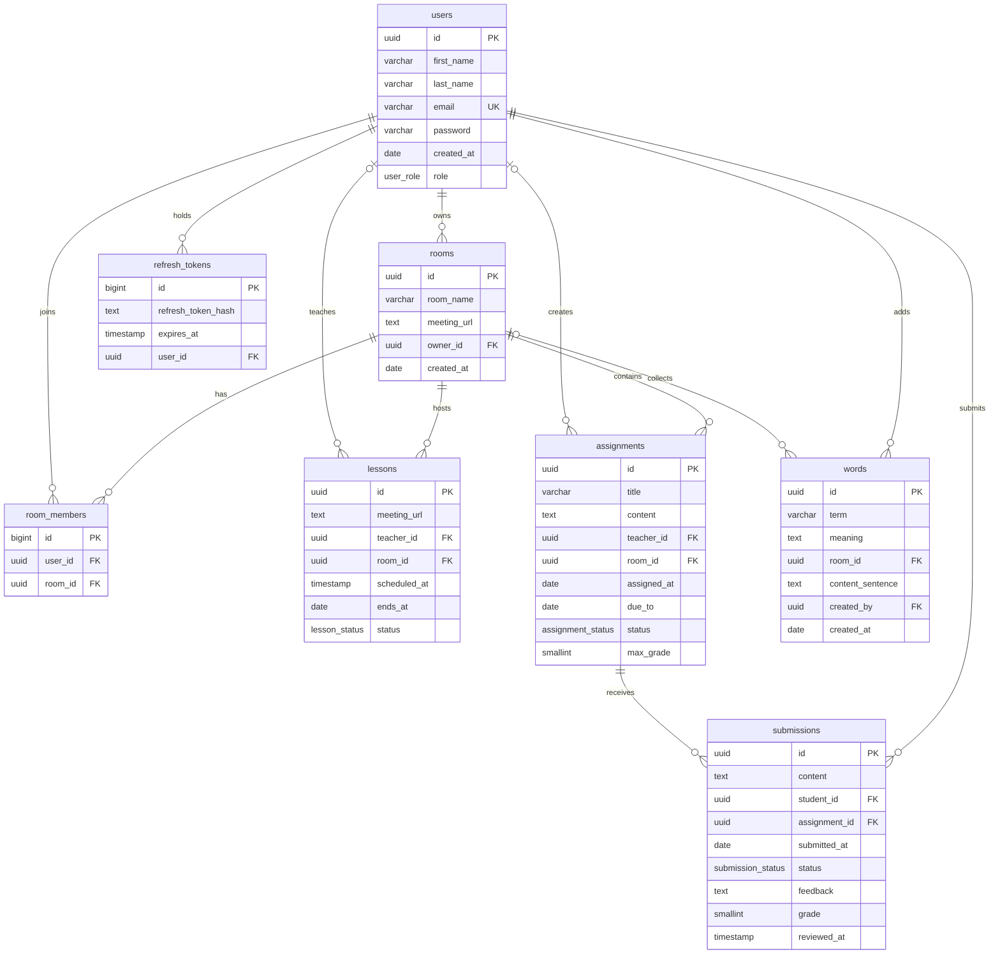

# Database Schema

Linguistix uses **PostgreSQL**, with migrations managed by [`node-pg-migrate`](https://github.com/salsita/node-pg-migrate).

- Migrations live in `migrations/`. From `apps/api`, run them with `pnpm migrate:dev up` (uses `../../.env`) or `pnpm migrate:test up` (uses `../../.env.test`).
- The current schema is defined in a single migration: `migrations/1791052707599_init.ts`.
- Most primary keys are UUID v7 (`DEFAULT uuidv7()`), so IDs sort by creation time. The built-in `uuidv7()` function needs **PostgreSQL 18+**. The `room_members` and `refresh_tokens` tables use a `BIGINT` identity column instead.

## Overview

| Table            | Purpose                                                           |
| ---------------- | ----------------------------------------------------------------- |
| `users`          | Every account on the platform, either a student or a teacher.     |
| `rooms`          | Classrooms or study groups, each with one owner.                  |
| `room_members`   | Join table linking users to the rooms they belong to.             |
| `lessons`        | Scheduled live sessions in a room, run by a teacher.              |
| `assignments`    | Homework a teacher sets for a room.                               |
| `submissions`    | A student's answer to an assignment, with its grade and feedback. |
| `words`          | Vocabulary entries, collected in a room or not tied to any room.  |
| `refresh_tokens` | Hashed refresh tokens issued to users at login.                   |

## ER Diagram

## Enum Types

| Type                | Values                                               | Used by              |
| ------------------- | ---------------------------------------------------- | -------------------- |
| `user_role`         | `student`, `teacher`                                 | `users.role`         |
| `lesson_status`     | `scheduled`, `completed`, `canceled`, `in_progress`  | `lessons.status`     |
| `assignment_status` | `draft`, `published`, `closed`                       | `assignments.status` |
| `submission_status` | `pending`, `submitted`, `needs_revision`, `reviewed` | `submissions.status` |

## Tables

### `users`

Every account on the platform. The `role` column decides whether the user is a student or a teacher.

| Column       | Type           | Null | Default        | Notes                    |
| ------------ | -------------- | ---- | -------------- | ------------------------ |
| `id`         | `UUID`         | no   | `uuidv7()`     | Primary key              |
| `first_name` | `VARCHAR(100)` | no   |                |                          |
| `last_name`  | `VARCHAR(100)` | no   |                |                          |
| `email`      | `VARCHAR(255)` | no   |                | Unique                   |
| `password`   | `VARCHAR(255)` | no   |                | Stores the password hash |
| `created_at` | `DATE`         | no   | `CURRENT_DATE` |                          |
| `role`       | `user_role`    | no   |                |                          |

### `rooms`

A classroom or study group. Lessons and assignments always belong to a room; vocabulary may.

| Column        | Type           | Null | Default        | Notes                                 |
| ------------- | -------------- | ---- | -------------- | ------------------------------------- |
| `id`          | `UUID`         | no   | `uuidv7()`     | Primary key                           |
| `room_name`   | `VARCHAR(100)` | no   |                |                                       |
| `meeting_url` | `TEXT`         | yes  |                | Default video-call link for the room  |
| `owner_id`    | `UUID`         | no   |                | FK → `users.id`, `ON DELETE RESTRICT` |
| `created_at`  | `DATE`         | no   | `CURRENT_DATE` |                                       |

Because of `RESTRICT`, you cannot delete a user who still owns a room. Delete the room or transfer ownership first.

### `room_members`

Many-to-many join table between `users` and `rooms`. A user can join a given room only once: `UNIQUE (user_id, room_id)`.

| Column    | Type     | Null | Default                        | Notes                                |
| --------- | -------- | ---- | ------------------------------ | ------------------------------------ |
| `id`      | `BIGINT` | no   | `GENERATED ALWAYS AS IDENTITY` | Primary key                          |
| `user_id` | `UUID`   | no   |                                | FK → `users.id`, `ON DELETE CASCADE` |
| `room_id` | `UUID`   | no   |                                | FK → `rooms.id`, `ON DELETE CASCADE` |

### `lessons`

A live session in a room, run by a teacher.

| Column         | Type            | Null | Default        | Notes                                     |
| -------------- | --------------- | ---- | -------------- | ----------------------------------------- |
| `id`           | `UUID`          | no   | `uuidv7()`     | Primary key                               |
| `meeting_url`  | `TEXT`          | yes  |                | Overrides the room's link for this lesson |
| `teacher_id`   | `UUID`          | yes  |                | FK → `users.id`, `ON DELETE CASCADE`      |
| `room_id`      | `UUID`          | no   |                | FK → `rooms.id`, `ON DELETE CASCADE`      |
| `scheduled_at` | `TIMESTAMP`     | no   | `CURRENT_DATE` | Default is midnight of the current day    |
| `ends_at`      | `DATE`          | no   |                |                                           |
| `status`       | `lesson_status` | no   | `'scheduled'`  |                                           |

> `scheduled_at` is a `TIMESTAMP` but `ends_at` is a `DATE`, so a lesson's end has no time of day.

### `assignments`

Homework a teacher sets for a room. Draft assignments can be incomplete. Any other status requires all content fields to be filled.

| Column        | Type                | Null | Default    | Notes                                 |
| ------------- | ------------------- | ---- | ---------- | ------------------------------------- |
| `id`          | `UUID`              | no   | `uuidv7()` | Primary key                           |
| `title`       | `VARCHAR(255)`      | yes* |            |                                       |
| `content`     | `TEXT`              | yes* |            |                                       |
| `teacher_id`  | `UUID`              | yes  |            | FK → `users.id`, `ON DELETE SET NULL` |
| `room_id`     | `UUID`              | no   |            | FK → `rooms.id`, `ON DELETE CASCADE`  |
| `assigned_at` | `DATE`              | yes* |            |                                       |
| `due_to`      | `DATE`              | yes* |            | Due date                              |
| `status`      | `assignment_status` | no   | `'draft'`  |                                       |
| `max_grade`   | `SMALLINT`          | yes* |            |                                       |

\* **`chk_published_field_not_null`**: when `status <> 'draft'`, the columns `title`, `content`, `assigned_at`, `due_to` and `max_grade` must all be non-null.

### `submissions`

A student's answer to an assignment, plus the teacher's review. A student can submit to a given assignment only once: `UNIQUE (student_id, assignment_id)`.

| Column          | Type                | Null | Default        | Notes                                      |
| --------------- | ------------------- | ---- | -------------- | ------------------------------------------ |
| `id`            | `UUID`              | no   | `uuidv7()`     | Primary key                                |
| `content`       | `TEXT`              | no   |                |                                            |
| `student_id`    | `UUID`              | no   |                | FK → `users.id`, `ON DELETE CASCADE`       |
| `assignment_id` | `UUID`              | no   |                | FK → `assignments.id`, `ON DELETE CASCADE` |
| `submitted_at`  | `DATE`              | no   | `CURRENT_DATE` |                                            |
| `status`        | `submission_status` | no   | `'pending'`    |                                            |
| `feedback`      | `TEXT`              | yes  |                | Teacher's comments                         |
| `grade`         | `SMALLINT`          | yes  |                |                                            |
| `reviewed_at`   | `TIMESTAMP`         | yes  |                | Set when the teacher reviews it            |

### `words`

Vocabulary entries, each with its meaning and an example sentence. A word with `room_id = NULL` is not tied to any room.

| Column             | Type           | Null | Default        | Notes                                 |
| ------------------ | -------------- | ---- | -------------- | ------------------------------------- |
| `id`               | `UUID`         | no   | `uuidv7()`     | Primary key                           |
| `term`             | `VARCHAR(255)` | no   |                |                                       |
| `meaning`          | `TEXT`         | no   |                |                                       |
| `room_id`          | `UUID`         | yes  |                | FK → `rooms.id`, `ON DELETE CASCADE`  |
| `content_sentence` | `TEXT`         | no   |                | Example sentence that uses the term   |
| `created_by`       | `UUID`         | no   |                | FK → `users.id`, `ON DELETE SET NULL` |
| `created_at`       | `DATE`         | no   | `CURRENT_DATE` |                                       |

> `created_by` is `NOT NULL` but its foreign key is `ON DELETE SET NULL`. Deleting a user who added any word therefore fails with a not-null violation.

### `refresh_tokens`

Refresh tokens issued to a user. Only a hash of each token is stored.

| Column               | Type        | Null | Default                        | Notes                                |
| -------------------- | ----------- | ---- | ------------------------------ | ------------------------------------ |
| `id`                 | `BIGINT`    | no   | `GENERATED ALWAYS AS IDENTITY` | Primary key                          |
| `refresh_token_hash` | `TEXT`      | no   |                                | Hash of the refresh token            |
| `expires_at`         | `TIMESTAMP` | no   |                                |                                      |
| `user_id`            | `UUID`      | no   |                                | FK → `users.id`, `ON DELETE CASCADE` |

## Delete Behaviour

| When this is deleted… | Effect                                                                                                                                                                                                       |
| --------------------- | ------------------------------------------------------------------------------------------------------------------------------------------------------------------------------------------------------------ |
| **User**              | Blocked if the user owns a room or added any word. Otherwise their memberships, lessons, submissions and refresh tokens are deleted, and their assignments keep existing with `teacher_id` set to `NULL`. |
| **Room**              | Its memberships, lessons, assignments (and so their submissions) and words are deleted.                                                                                                                      |
| **Assignment**        | Its submissions are deleted.                                                                                                                                                                                 |
